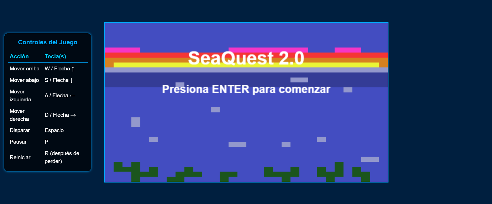
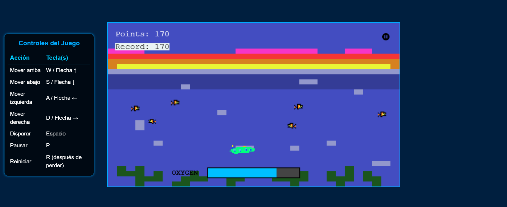
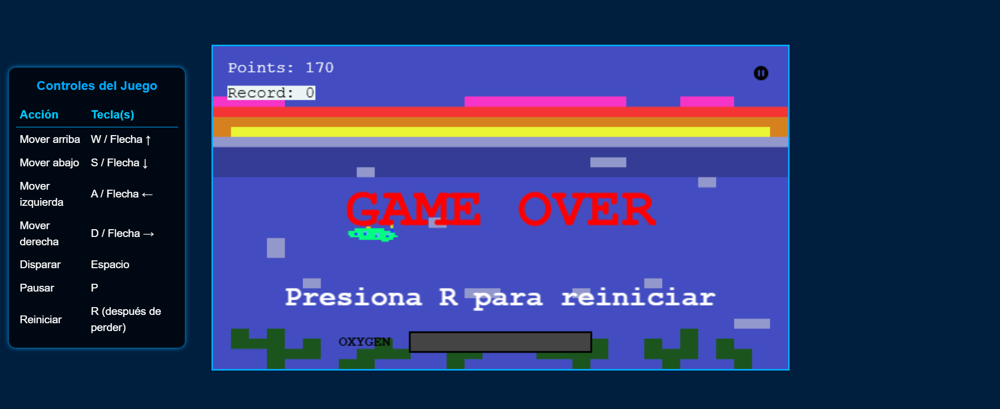

# SeaQuest Remastered

Un homenaje moderno al clásico **SeaQuest (Atari, 1983)**. 
Sumérgete en un mar lleno de peligros, enemigos submarinos y retos crecientes. ¡Pilota tu submarino, esquiva amenazas y sobrevive a los niveles infinitos!

## Historia

En un futuro distópico, los océanos están controlados por fuerzas enemigas. Como comandante del último submarino de la resistencia, tu misión es destruir a los invasores y sobrevivir a las profundidades. ¿Hasta qué nivel podrás llegar?

---

## Controles

| Acción         | Tecla                           |
|----------------|---------------------------------|
| Mover arriba   | `W` o `Flecha ↑`                |
| Mover abajo    | `S` o `Flecha ↓`                |
| Mover izquierda| `A` o `Flecha ←`                |
| Mover derecha  | `D` o `Flecha →`                |
| Disparar       | `Espacio`                       |
| Pausar juego   | `P`                             |
| Reiniciar      | `R` (cuando el juego termina)   |

---

## Instrucciones de juego

- Enfrenta niveles infinitos de enemigos submarinos.
- Dispara para destruirlos y ganar puntos.
- Si un enemigo te toca, recibes daño.
- Gana salud al pasar cada nivel que pase.
- Sobrevive el mayor tiempo posible.

---

## Instalación y ejecución del juego

### 1. Clonar el repositorio

```bash
git clone https://github.com/Dixon282005/Game.git
cd Game

```
### 2. Instala las dependencias

Asegúrate de tener Node.js instalado.

```bash
npm install

```
3. Inicia el juego

```bash
npm start
```
Esto abrirá el juego automáticamente en tu navegador por defecto.
Generalmente se abrirá en http://localhost:3000/ o similar.

## Pantalla de Inicio



## Gameplay



## Game Over


## Tecnologías Utilizadas

- HTML5
- CSS3
- JavaScript
- Phaser3
- Git y Github

### Proyecto para materia Electiva V, creado por: 
- Dixon Ramos. C.I: 31.073.511
- Miguel Ponce. C.I: 31.031.348


